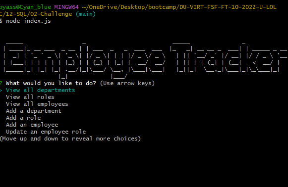

# Employee-Tracker

## Table of Contents

- [Introduction](#introduction)
- [Installation](#installation)
- [Usage](#usage)
- [License](#license)
- [Contribution](#contribution)
- [Tests](#tests)
- [Contact Information](#contact-information)
- [Screenshot](#screenshot)

## Introduction

it an aplication that saves eployes inmformation with in the company

## Installation

First, make sure you have Node.js and npm (Node Package Manager) installed on your machine.

Next, clone the repository from GitHub to your local machine.

Open a command prompt or terminal window and navigate to the root directory of the application.

Run the command "npm install" to download and install all of the required packages listed in the package.json file. This will install inquirer, mysql2, figlet, and any other dependencies that the script needs to run.

Once all the packages are installed, you can run the script by executing the command "node index.js" or "npm start" if start script is defined in package.json file.

## Usage

if you are starting a company you could use this aplication to keep track of you employees salary role and departmen you coulod also creat new roles, departments and add new employees and manegers.

## License

This project is licensed under the [MIT](https://opensource.org/licenses/MIT) license.

## Contributing

N/A

## Tests

N/A

## Contact Information

- **GitHub username:** [oyassine1999](https://github.com/oyassine1999)
- **Email:** thvas1911@gmail.com

## Video link: https://drive.google.com/file/d/1oYJMNHi8V5ysA8v7rrTKbWrjykzq9GkT/view?usp=sharing

## Screenshot

